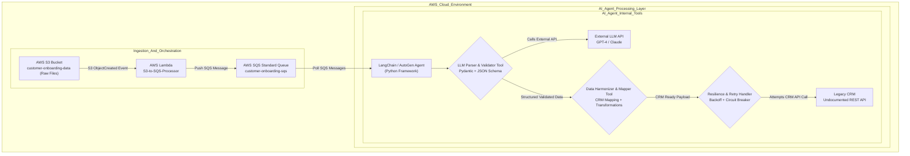

# Enterprise Data & Agentic Workflow Integration for Automated Customer Onboarding

## Problem Statement

An enterprise client faces challenges in automating their customer onboarding process. Key issues include:

*   **Legacy CRM System:** An existing Customer Relationship Management (CRM) system with an undocumented REST API.
*   **Unstructured Data:** Customer onboarding data resides in an AWS S3 bucket, often in varied, unstructured formats (PDFs, CSVs, JSON, etc.).
*   **API Resilience:** The legacy CRM API is prone to rate-limiting and intermittent failures, requiring robust error handling and retry mechanisms.

The goal is to design and implement an AI agent-driven workflow that can ingest this unstructured S3 data, intelligently parse it using a Large Language Model (LLM), handle API failures gracefully, and successfully update the client's legacy CRM system.

---

## 1. Technical Architecture Diagram
## Architecture Diagram

